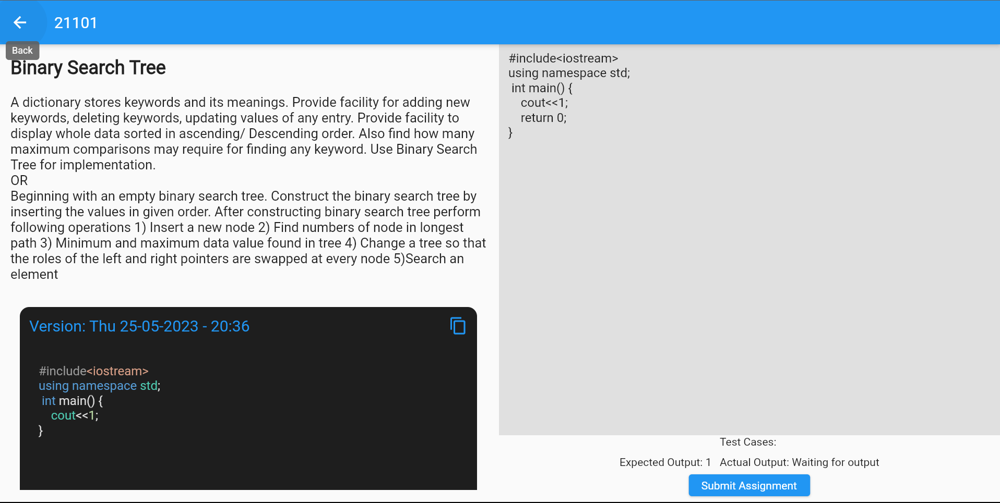

# KodeKraken
Second year PBL project built in flutter and used firebase as backend. Implemented uploading of assignments, 
version control, inbuilt code editor, student and teacher login functionality.

## Key Functionalities:
- Login functionality implemented with the help of firebase-auth
- Student and teacher logins for secure access and assignment tracking.
- Student functionality includes assignment uploads, viewing submission dates, and test cases.
- Versioning is also implemented.
- Teacher can see the assignments submitted by the students and grade the assignments accordingly.
- The app offers an integrated code editor for convenient code writing and submissions.
- Firebase integration manages backend functions efficiently.

## Project Screenshot

### Student Side
---

---

### Teacher Side
---

---
